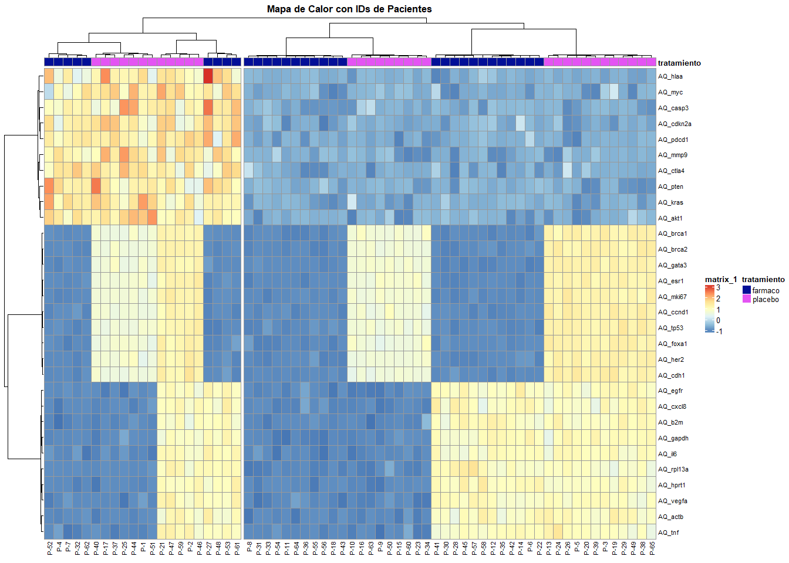

visualización de datos biológicos y análisis estadístico
================
xiomyjonas-code
2026-01-05

- [1 Comparación de expresión génica por
  tratamiento](#1-comparación-de-expresión-génica-por-tratamiento)
  - [1.1 Boxplots (Expresión genica según
    tratamiento)](#11-boxplots-expresión-genica-según-tratamiento)
    - [1.1.1 INTERPRETACIÓN](#111-interpretación)
- [2 Histogramas bioquímicos](#2-histogramas-bioquímicos)
  - [2.1 Histogramas bioquímicos con curva de
    densidad](#21-histogramas-bioquímicos-con-curva-de-densidad)
    - [2.1.1 INTERPRETACIÓN](#211-interpretación)
- [3 Mapa de Calor (Heatmap) de Expresión
  Génica](#3-mapa-de-calor-heatmap-de-expresión-génica)
  - [3.1 Histogramas bioquímicos con curva de
    densidad](#31-histogramas-bioquímicos-con-curva-de-densidad)
    - [3.1.1 INTERPRETACIÓN](#311-interpretación)

<style>
body {
text-align: justify;
}
</style>

Carga de Librerías

``` r
# Limpieza del entorno
rm(list=ls())
# Librerías 
library(dplyr) #Manipular y transformar dataframes de manera intitiv y eficiente
library(ggplot2) #Create Elegant Data Visualisations
library(patchwork) #Strong API for sequentially building up a plot
library(tidyr) #Limpiar y organizar datos
library(pheatmap) #Genera mapas de calor agrupados de una matriz numerica  
library(ComplexHeatmap) #crear mapas de calor personalizados y de alta calidad
library(grid) #Rewrite of the graphics layout capabilities
```

Carga de Datos

``` r
# Datos (archivo csv) 
datos <- read.csv("dataset_genes_oct2025.csv", stringsAsFactors = TRUE)

# Exploración inicial
#head(datos) #Muestra la estructura interna de los datos
```

# 1 Comparación de expresión génica por tratamiento

``` r
## ----------------------------------------------------------
## Ejercicio 1: Comparación de expresión génica por tratamiento
## ----------------------------------------------------------

# Tema base 
tema <- theme_minimal() +
            theme(legend.position = "none", # Sin leyenda individual
                  plot.title = element_text(size = 10, face = "bold"),
                  axis.title.x = element_blank()) # Sin etiqueta X

## Expresión génica 
gen1 <- ggplot(datos, aes(x = tratamiento, y = AQ_esr1, fill = tratamiento)) + 
  geom_boxplot(alpha=0.7) + labs(title= "AQ_ESR1", y = "Nivel AQ") + 
  scale_fill_brewer(palette = "Set2") + tema
  
gen2 <- ggplot(datos, aes(x = tratamiento, y = AQ_her2, fill = tratamiento)) +
  geom_boxplot(alpha = 0.7) + 
  labs(title = "AQ_HER2", y = "Nivel AQ") +
  scale_fill_brewer(palette = "Set2") + tema

gen3 <- ggplot(datos, aes(x = tratamiento, y = AQ_brca1, fill = tratamiento)) +
  geom_boxplot(alpha = 0.7) +
  labs(title = "AQ_BRCA1", y = "Nivel AQ") +
  scale_fill_brewer(palette = "Set2") + tema

gen4 <- ggplot(datos, aes(x = tratamiento, y = AQ_brca2, fill = tratamiento)) +
  geom_boxplot(alpha = 0.7) +
  labs(title = "AQ_BRCA2", y = "Nivel AQ") +
  scale_fill_brewer(palette = "Set2") + tema

gen5 <- ggplot(datos, aes(x = tratamiento, y = AQ_mki67, fill = tratamiento)) +
  geom_boxplot(alpha = 0.7) +
  labs(title = "AQ_MKI67", y = "Nivel AQ") +
  scale_fill_brewer(palette = "Set2") + tema

gen6 <- ggplot(datos, aes(x = tratamiento, y = AQ_gata3, fill = tratamiento)) +
  geom_boxplot(alpha = 0.7) +
  labs(title = "AQ_GATA3", y = "Nivel AQ") +
  scale_fill_brewer(palette = "Set2") + tema

gen7 <- ggplot(datos, aes(x = tratamiento, y = AQ_foxa1, fill = tratamiento)) +
  geom_boxplot(alpha = 0.7) +
  labs(title = "AQ_FOXA1", y = "Nivel AQ") +
  scale_fill_brewer(palette = "Set2") + tema

gen8 <- ggplot(datos, aes(x = tratamiento, y = AQ_ccnd1, fill = tratamiento)) +
  geom_boxplot(alpha = 0.7) +
  labs(title = "AQ_CCND1", y = "Nivel AQ") +
  scale_fill_brewer(palette = "Set2") + tema

gen9 <- ggplot(datos, aes(x = tratamiento, y = AQ_cdh1, fill = tratamiento)) +
  geom_boxplot(alpha = 0.7) +
  labs(title = "AQ_CDH1", y = "Nivel AQ") +
  scale_fill_brewer(palette = "Set2") + tema

gen10 <- ggplot(datos, aes(x = tratamiento, y = AQ_tp53, fill = tratamiento)) +
  geom_boxplot(alpha = 0.7) +
  labs(title = "AQ_TP53", y = "Nivel AQ") +
  scale_fill_brewer(palette = "Set2") + tema

# Unimos los gráficos (usando + para sumar y plot_layout para organizar)
exp_genes_boxplots <- gen1 + gen2 + gen3 + gen4 + gen5 + gen6 + gen7 + gen8 + 
                      gen9 + gen10 + plot_layout(ncol = 3)
```

## 1.1 Boxplots (Expresión genica según tratamiento)

A continuación se presenta la expresión genética de los 10 genes
respecto al tratamiento en diagramas de caja (boxplots).

``` r
exp_genes_boxplots
```

<!-- -->

### 1.1.1 INTERPRETACIÓN

El análisis de los diagramas de caja muestran notables diferencias en la
eficacia del tratamiento. En el grupo Placebo (color naranja), las
medianas de expresión permanecen elevadas (alrededor de 0.9 AQ).
Biológicamente, esto es consistente con un fenotipo tumoral activo y
agresivo, donde los receptores hormonales (AQ_ESR1) y factores de
crecimiento (AQ_HER2) continúan operando sin restricciones terapéuticas,
impulsando el desarrollo del cáncer.

En contraste, el grupo Fármaco (color verde) muestra una reducción
drástica de la expresión génica, con valores cercanos 0 AQ. Esto sugiere
que el tratamiento actúa como un potente inhibidor transcripcional de
efecto pleiotrópico: no solo frena la proliferación celular —evidenciado
por la caída de AQ_MKI67 y AQ_CCND1—, sino que aparentemente induce el
colapso de la maquinaria celular al silenciar genes críticos de
reparación del ADN (AQ_BRCA1/2, AQ_TP53) y supervivencia.

Finalmente, la presencia de valores atípicos (outliers) en el grupo
tratado posee relevancia biológica. Aunque la dispersión estadística es
mínima debido a la alta eficacia del fármaco, estos puntos indican una
heterogeneidad tumoral o variabilidad individual. Sugieren que un
pequeño subgrupo de pacientes mantiene una actividad residual leve,
resistiendo parcialmente a la supresión total lograda en la mayoría de
la muestra.

# 2 Histogramas bioquímicos

``` r
## ----------------------------------------------------------
## Histogramas bioquímicos
## ----------------------------------------------------------

# Definir función para el estilo de los histogramas 
# after_stat(density) para que la curva de densidad se ajuste a las barras
estilo_h <- list(geom_histogram(aes(y = after_stat(density)), bins = 30, fill = "lightpink1", color = "white", alpha = 0.7),
  geom_density(alpha = 0.2, fill = "lightpink1"),
  theme_minimal(),
  labs(y = "Densidad"), # Etiqueta "Y" común
  theme(plot.title = element_text(size = 10, face = "bold"), axis.title.x = element_blank())) # Sin la X para no repetir nombre

# Células sanguíneas e inmunes
h1 <- ggplot(datos, aes(x = glucosa)) + estilo_h + labs(title = "Glucosa")
h2 <- ggplot(datos, aes(x = leucocitos)) + estilo_h + labs(title = "Leucocitos")
h3 <- ggplot(datos, aes(x = linfocitos)) + estilo_h + labs(title = "Linfocitos")
h4 <- ggplot(datos, aes(x = neutrofilos)) + estilo_h + labs(title = "Neutrófilos")

# Grupo: Lípidos (Colesterol y grasas)
h5 <- ggplot(datos, aes(x = chol)) + estilo_h + labs(title = "Colesterol Total")
h6 <- ggplot(datos, aes(x = hdl)) + estilo_h + labs(title = "HDL (Bueno)")
h7 <- ggplot(datos, aes(x = ldl)) + estilo_h + labs(title = "LDL (Malo)")
h8 <- ggplot(datos, aes(x = trigliceridos)) + estilo_h + labs(title = "Triglicéridos")

#Grupo:Inmunoglobulinas
h9 <- ggplot(datos, aes(x = iga)) + estilo_h + labs(title = "IgA")
h10 <- ggplot(datos, aes(x = ige)) + estilo_h + labs(title = "IgE")
h11 <- ggplot(datos, aes(x = igg)) + estilo_h + labs(title = "IgG")
h12 <- ggplot(datos, aes(x = ign)) + estilo_h + labs(title = "IgN")

#Grupo: marcadores bioquímicos
h13 <- ggplot(datos, aes(x = hierro)) + estilo_h + labs(title = "Hierro")
h14 <- ggplot(datos, aes(x = pcr)) + estilo_h + labs(title = "PCR (Inflamación)")
h15 <- ggplot(datos, aes(x = transferrina)) + estilo_h + labs(title = "Transferrina")
h16 <- ggplot(datos, aes(x = cpk)) + estilo_h + labs(title = "CPK")

panel_histogramas <- (h1 + h2 + h3 + h4) / 
                     (h5 + h6 + h7 + h8) / 
                     (h9 + h10 + h11 + h12) / 
                     (h13 + h14 + h15 + h16) +
                     plot_annotation(
                       title = "Distribución de Parámetros Bioquímicos",
                       subtitle = "Histogramas con curva de densidad (Bins = 30)",
                       caption = "Fuente: MUBioinfo Dataset"
                     )
```

## 2.1 Histogramas bioquímicos con curva de densidad

``` r
panel_histogramas
```

<!-- -->

### 2.1.1 INTERPRETACIÓN

**Interpretación de la distribución de los datos de las variables
bioquímicas en toda la población.**

Los histogramas de frecuencia sobre la población estudiada muestran que
a nivel general las variables bioquímicas reflejan la variabilidad
biológica de cada paciente (metabolismo, estado de salud, dieta etc). Es
posible identificar dos tipos de comportamientos. En primera instancia
estan las variables homeostáticas altamente reguladas, en las que el
cuerpo buscar mantener el equilibrio en un punto medio exacto
(homeostasis) como la trasnferrina (transporte de hierro desde el
intestino a la médula ósea), la gráfica de Hierro (el cuerpo no lo deja
bajar (anemia) ni subir (toxicidad), y la IgA (primera línea de
defensa), por ello la mayoría de pacientes tiene valores centrales,
creando esa forma de campana casi perfecta.

Por otro lado, marcadores de patología o estilo de vida, como la PCR
(Proteína C Reactiva), la IgE y los Triglicéridos, presentan
distribuciones donde la mayoría de los individuos tienen valores bajos
(basales), pero existe una cola (tail) larga de pacientes con valores
extremadamente altos. Estos valores extremos en las colas derechas de
los gráficos probablemente corresponden a los pacientes con condiciones
patológicas activas, procesos inflamatorios o con desnivel o alteración
en las grasas (lípidos) de la sangre (dislipidemias severas) dentro de
la muestra clínica.

**Distribución según gráficas.**

A. Distribución con Tendencia Normal / Simétrica (Campana de Gauss)
(Gráficas centradas, unimodales, colas uniformes)

1.  Transferrina (La más perfecta, centrada en ~250)
2.  Colesterol Total (Centrada en ~180)
3.  IgA (Unimodal, centrada en ~180)
4.  Hierro (Centrada en ~60)
5.  HDL (Colesterol bueno, centrada en ~50)
6.  Linfocitos (Aproximadamente simétrica)

B. Distribución Sesgada / Asimetría Positiva (No Normal) (Gráficas con
pico a la izquierda y cola larga a la derecha)

7.  Glucosa (Pico basal y cola de hiperglucemia)
8.  LDL (Colesterol malo)
9.  Triglicéridos
10. Leucocitos
11. Neutrófilos
12. IgN (IgM)
13. CPK
14. IgE (Asimetría extrema)
15. PCR (Asimetría extrema / Exponencial)

C. Distribución Irregular / Bimodal.

16. IgG (Muestra múltiples picos o irregularidad central)

***Conclusión*** Basado en la observación de los histogramas y las
curvas de densidad superpuestas, se concluye que no todas las variables
siguen una distribución normal o simétrica.

Se identifica un grupo específico que sí se ajusta a una distribución
compatible con la Campana de Gauss (unimodal y centrada). Este incluye a
la Transferrina, Colesterol Total, HDL, Hierro, Linfocitos e IgA. La
simetría en estos parámetros sugiere que están sujetos a una regulación
homeostática estricta, manteniendo a la mayoría de la población en un
rango promedio estable.

Por el contrario, gran parte de las variables bioquímicas exhibe una
clara asimetría positiva (sesgo a la derecha), alejándose de la
normalidad. Esto es evidente en la Glucosa, LDL, Triglicéridos,
Leucocitos, Neutrófilos, IgM (IgN), CPK, IgE y PCR. En estos casos, la
frecuencia se acumula en valores basales (izquierda), mientras que la
“cola” derecha se extiende debido a la presencia de individuos con
valores patológicos elevados (como dislipidemias o infecciones agudas).
Finalmente, la IgG presenta un comportamiento irregular o bimodal que
tampoco se ajusta a la normalidad estricta.

# 3 Mapa de Calor (Heatmap) de Expresión Génica

## 3.1 Histogramas bioquímicos con curva de densidad

``` r
# ----------------------------------------------------------
# Ejercicio 3: Mapa de Calor (Heatmap) de Expresión Génica
# ----------------------------------------------------------
# Seleccionar columnas que empiezan por "AQ" 
datos_genes <- datos %>% 
  select(starts_with("AQ", ignore.case = TRUE)) #crea una matriz con los datos de los genes y el id                                                 #del paciente

# Escalado de datos: Normalizar los valores (Media=0, Desviación=1)
matriz_scaled <- scale(datos_genes) #Asegurar que las variables contribuyan equitativamente al                                         #análisis

# Transposición de la matriz, para que el Eje X = Pacientes, Eje Y = Genes
matriz_final <- t(matriz_scaled) 

# Preparar anotaciones del heatmap 
colnames(matriz_final) <- paste0("P-", datos$id) #Pegar los IDs directamente a las columnas de la matriz 
anotaciones <- datos %>% select(tratamiento) #seleccionar tratamiento
rownames(anotaciones) <- colnames(matriz_final) #Asegurar que las filas de la anotación coincidan                                                  #con las 


# Generar el Heatmap
set.seed(1995) # Semilla para reproducibilidad
pheatmap(
  matriz_final, #datos transpuestos
  annotation_col = anotaciones,  #barra de colores de tratamiento: placebo, fármaco.
  scale = "none", #ya se escalaron los datos previamente
  clustering_method = "ward.D2", #Método Ward intenta crear grupos compactos y esféricos
  cutree_cols = 2, #2 ramas principales (fármaco y placebo)
  show_colnames = TRUE,   #Muestra nombres de columnas  (pacientes IDS)
  fontsize_col = 8,       
  angle_col = NULL,       #Poner nombres en la mejor disposición 
  fontsize_row = 8,       #filas
  main = "Mapa de Calor con IDs de Pacientes" #título principal del gráfico
)
```

<!-- -->

### 3.1.1 INTERPRETACIÓN

El mapa de calor de la expresión génica muestra en el *eje x* a los 65
pacientes (IDS) y en el *eje y* la expresión AQ de los 30 genes. Los
valores que han sido normalizados (escalados, con Media=0,
Desviación=1), muestran niveles AQ cercanos a -1 (color azul oscuro,
Z-score negativo), siguiendo la escala de calor los niveles AQ cercanos
a 0 se presentan de color celeste y para aquellos genes cuyos valores
están entre niveles de expresión AQ 2 y 3 se visualiza con el color
naranja y rojo (Z-score positivo), respectivamente. Además de la
expresión y los pacientes, en la parte superior del mapa se detallan el
tratamiento que ha recibido cada paciente (tratamiento de color azul
eléctrico y placebo de color fucsia). Por lo que se visualiza claramente
que los pacientes que han usado el fármaco muestran niveles de
silenciamiento de los genes alto (por ello se visualizan de color azul)
respecto a aquellos que solo recibieron el placebo.

Existen valores AQ de genes que se encuentran en la parte superior
derecha que están expresados en los pacientes, separados con un espacio
en blanco delgado del lado superior izquierdo. El grupo de la
derecha-superior Se encuentra mayoritariamente de color celeste,
significando que existe un silenciamiento de estos genes, tanto en el
grupo placebo como en el grupo fármaco. Mientras que el grupo de la
izuierda-superior presenta estos genes expresados estando en niveles de
expresión 2 y 3. Eso significariía que estos genes dependen mucho de
factores metabólicos de los genes inherentes de cada paciente o a la
evolución o estadío del cancer respecto a la enfermedad. Los niveles AQ
expresados en esta franja son: AQ_hlaa (Presentación de antígenos),
AQ_myc (Gen maestro del crecimiento y metabolismo), AQ_casp3 (Caspasa
ejecutora de la muerte celular), AQ_cdkn2a (Inhibidor del ciclo
celular), AQ_pdcd1 y AQ_ctla4 (Checkpoints del sistema inmune), AQ_mmp9
(Rompe la matriz para que el tumor invada). AQ_pten (Freno de la vía AKT
(evita crecimiento excesivo)), AQ_kras (Vía de señalización de
crecimiento (MAPK)), AQ_akt1 (Vía de supervivencia y crecimiento
(PI3K/AKT).

A partir del nivel AQ del gen AQ_BCR1 (sección media) del heatmap,
existe similitudes en los pacientes del grupo fármaco cuyos genes se
encuentran silenciados (color azul), mientras que los pacientes del
grupo placebo muestran niveles de expresión más altos (color naranja).
De manera que el fármaco está actuando mayoritariamente, al inhibir la
expresión de la tríada luminal (ESR1, GATA3, FOXA1), lo que sugiere una
pérdida de la identidad celular hormono-dependiente. Simultáneamente, el
silenciamiento de los guardianes genómicos (BRCA1/2, TP53) deja a las
células tumorales desprovistas de sus mecanismos de reparación de ADN,
volviéndolas vulnerables al colapso genético (letalidad sintética). El
hecho de que marcadores de agresividad como HER2 y MKI67 también se vean
reprimidos confirma que el fármaco logra detener la maquinaria
proliferativa central del tumor.

Mientras que en la sección inferior parece existir un silenciamiento en
genes del grupo tratamiento aunque de placebo tambien en igual medida. Y
hay expresión genética en el tratamiento y placebo. Esta última sección
representaría a genes que cumplen funciones de mantenimiento basal
(GAPDH, ACTB, RPL13A) y mediadores de inflamación y angiogénesis (IL6,
TNF, VEGFA). Esto (en el grupo placebo) indica una expresión basal
fisiológica: el tumor mantiene sus funciones metabólicas y estructurales
activas pero no necesariamente sobreexpresadas. En el grupo fármaco (con
valores Z-score negativos), sugiere que el tratamiento no solo ataca las
vías oncogénicas hiperactivas, sino que compromete la viabilidad celular
básica.
